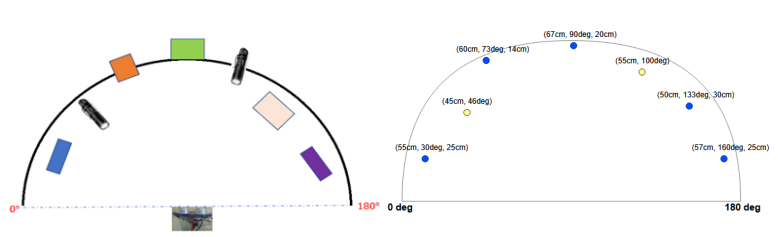

# Embedded Real-Time Sensor-Based Detection System (MSP430)

A multi-mode embedded system designed and implemented using the MSP430 MCU. The project supports object detection, light source scanning, telemeter mode, UART communication with error handling, and PC GUI interaction for mode selection, calibration, and file/script management.

##  Features

- **Object & Light Source Detection**:  
  Real-time detection using ultrasonic and LDR sensors across a 180° scanning arc controlled by a servo motor.

- **FSM-Based Mode Switching**:  
  A robust FSM controls transitions between 10 operating modes, including Sleep, Object Detector, Light Scanner, Telemeter, and file management.

- **UART Communication**:  
  serial communication (RS-232), with error checking and feedback for invalid inputs, ensuring reliability.

- **PC GUI Integration**:  
  Python-based graphical interface for visualization, calibration, and interaction with the MCU. Supports:
  - Reading sensor data in real time
  - Uploading and executing script files
  - Sending/receiving `.txt` files via UART

- **Modular Layered Design**:  
  Structured codebase in **BSP / HAL / API** layers with separation of concerns between hardware control, logic, and user interaction.

- **Additional Features**:
  - Servo control via PWM
  - Flash memory file system for scripts and text files
  - LDR sensor calibration
  - GUI-based mode switching

## Repository Structure

| Directory        | Description                                      |
|------------------|--------------------------------------------------|
| `source/`          | Embedded C source files for the MSP430, organized in layered structure (BSP, HAL, API)            |
| `header/`          | Header files and MCU configuration constants for the embedded system                              |
| `DCS_PC_SIDE/`     | Python-based GUI scripts and PC-side utilities (UART interface, calibration, file/script tools)   |

## MCU (MSP430G2553)

## Sensors

## Visualization

## FSM State Machine

## How to Run

1. Flash the compiled MCU code to the MSP430.
2. Connect to the PC via UART (baud rate: 9600).
3. Launch the PC GUI using:
